---

title: Node.js入门指北
date: 2020-07-10
authors: 
    - ChenKS
categories:
    - blog
tags: JavaScript node.js
---

`Node.js`是作为一个前端开发者必备的技术栈。

正如官方中说的那样，`Node.js`是一个基于 Chrome V8 引擎的 JavaScript 运行时。

> Node.js® is a JavaScript runtime built on [Chrome's V8 JavaScript engine](https://v8.dev/).

`Node.js`让 JavaScript 代码可以脱离浏览器，在其他环境运行，这也是前端工程化的基础

<!--more-->

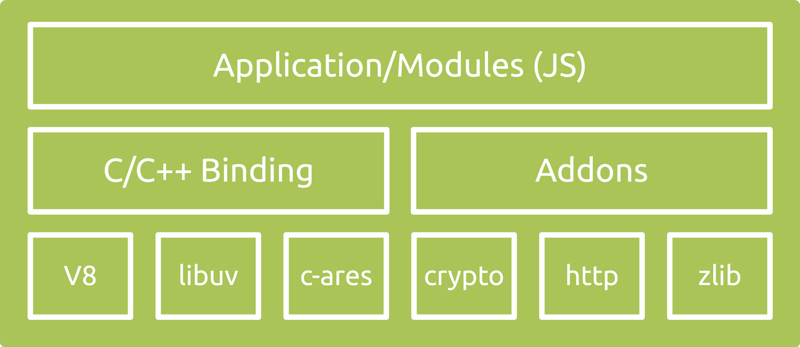

## 环境安装

进入`node.js`官方 https://nodejs.org/en/ ，他会自动根据你的环境推荐安装包。`windows`环境推荐选择`.msi`后缀的安装文件，安装过程就是一路确定到底就可以了。`mac`推荐使用`HomeBrew`下载~~HomeBrew 真香~~

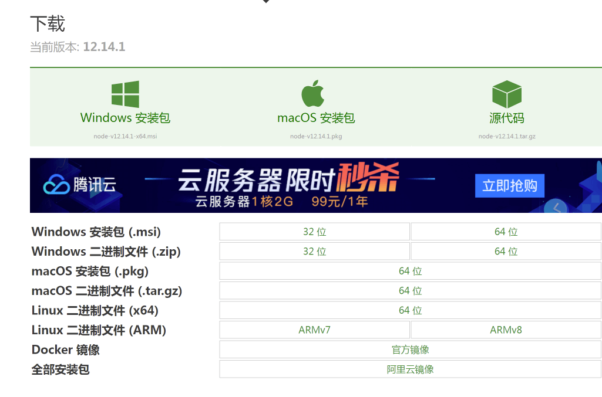

安装成功后，打开一个终端，windows 上可以选择`cmd`或`powershell` ,输入

```bash
node -v
```

如果有 node 版本结果，则安装成功。

具体步骤：

1. 按住 win+R
2. 输入 `cmd` 或者 `powershell`
3. 输入`node -v`

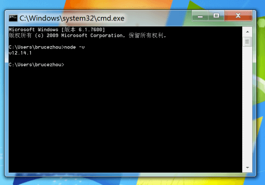

## 初次使用

试试直接在终端中直接输入`node`，就会进入这个界面。这是 node.js 交互式解释器，可能用过`python`的同学就会有点熟悉了。我们可以直接输入`JavaScript`代码并执行，而不需要浏览器环境。

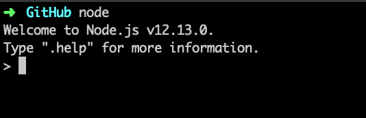

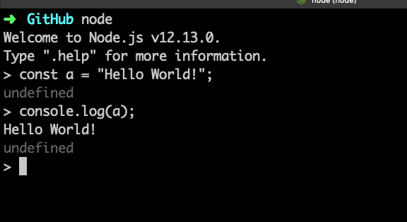

和`python`类似，我们不仅可以这样一行一行执行，也可以用来执行一个 JavaScript 文件，我们可以通过在终端中执行`node <文件名>`来执行文件，或者使用 vs code 中的 插件`Code Runner`来运行。

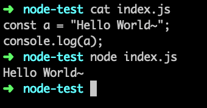

## node 环境和浏览器环境的区别

node 环境中的少了浏览器中的一些 api，像`document`,`window`,`alert`,`history`都是不支持的。

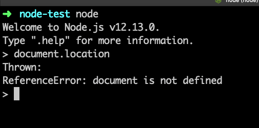

但是它也增加了许多特性。像 I/O 读写和模块加载之类的东西。

这是使用 node.js 读取文本文件。~~这就比用 C 语言简单多了~~

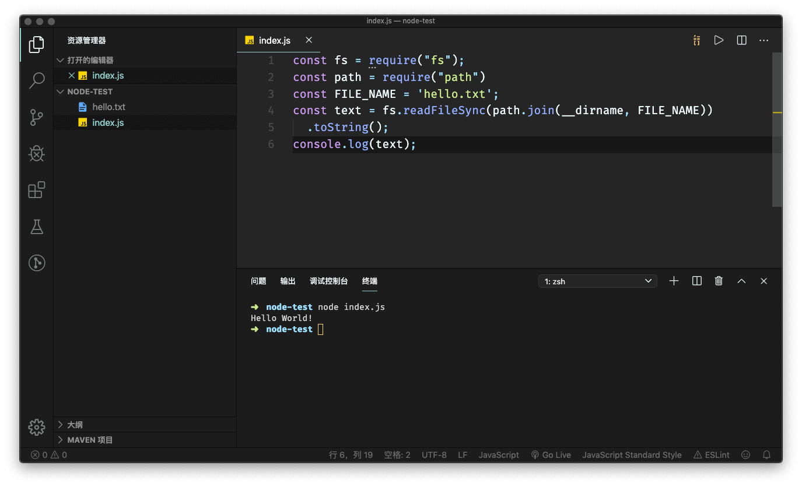

## 什么是 npm

npm~~是"您配吗",呸~~ 是 Node Package Manager，也就是 Node 的包管理器。

了解过`python`的同学可能知道`pip`，`npm`和他有点类似。但是 pip 的包下载后是全局的，npm 可以将依赖（或者称它为包）可以下载到工作区或者下载到全局。

一般来说，安装了`node`后，`npm`也安装好了。可以使用`npm -v`确认一下。

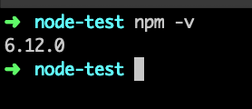

## npm 官网

https://www.npmjs.com/

npm 是世界上最大的包管理~~不是我瞎说的，官网写的~~。

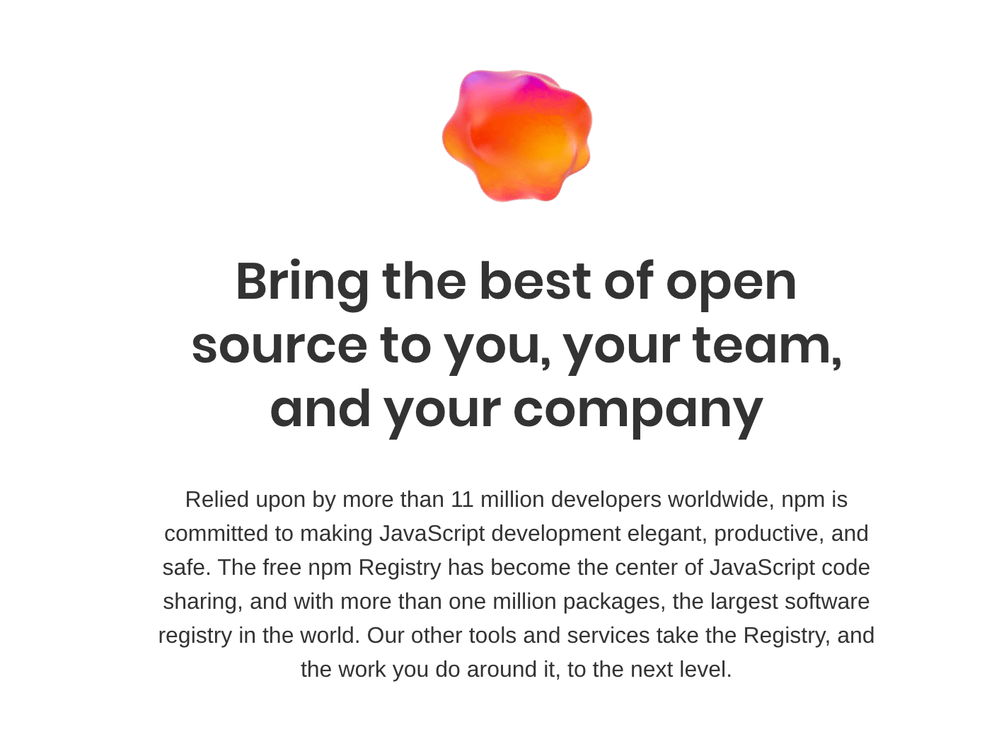

> Relied upon by more than 11 million developers worldwide, npm is committed to making JavaScript development elegant, productive, and safe. The free npm Registry has become the center of JavaScript code sharing, and with more than one million packages, the largest software registry in the world. Our other tools and services take the Registry, and the work you do around it, to the next level.

我们也可以在这上边寻找我们一些其他人的造好的轮子，像一些前端开发框架的脚手架`@vue/cli`,`create-react-app`之类的，还有 node.js 后端框架`express`,`koa`,`egg`之类的，以及一些其他好用的工具。

## 一些其他的包管理

`npm`也有一些令人诟病的地方，像安装速度慢，依赖关系树，镜像以及其他之类的问题，因此出现了一些其他的 node 的包管理器，像`cnpm` ,`yarn` 之类的，可以去了解一下。

## package.json

这是一个 node 项目或者说是一个 npm 包的必备的文件。它包含了项目的必要的信息，以及这个项目所依赖的一些的依赖。

在终端中进入项目所在的目录，输入`npm init -y`
就可以一键生成配置文件。
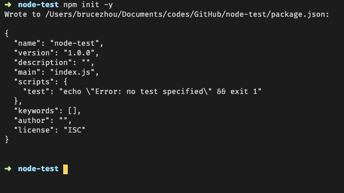

一些重要的字段像`scripts`,`dependencies`,`devDependencies`有必要了解。

可以参考这个， https://javascript.ruanyifeng.com/nodejs/packagejson.html

| 字段名          | 作用                                                                                        |
| --------------- | ------------------------------------------------------------------------------------------- |
| scripts         | 指定了运行脚本命令的 npm 命令行缩写，比如 start 指定了运行`npm run start`时，所要执行的命令 |
| dependencies    | 指定了项目运行所依赖的模块                                                                  |
| devDependencies | 指定项目开发所需要的模块                                                                    |

## 如何使用 node.js 过滤问卷名单

这就当是一个简单的使用 node.js 的例子吧。我们的寒假项目需要非科协的同学填写问卷，但是有科协的同学填写了问卷，这时我们就需要过滤人员的名单。


我们简单看一下这个需求，我们需要读取一个 excel，然后过滤"隔壁软软-钟敏睿"，重新生成一个新的 excel。

那么我们怎么使用 node.js 读取 excel 呢。首先作为一个~~调包侠，呸~~ 优秀的程序员，我们需要去看一下有什么其他大佬写好的代码可以用。我使用的是[node-xlsx](https://www.npmjs.com/package/node-xlsx)

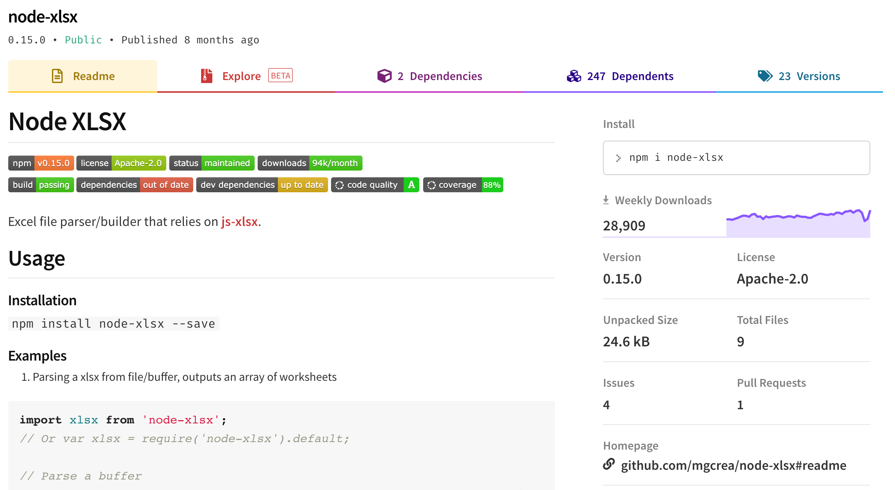

我们进入项目后，执行`npm install --save node-xlsx`

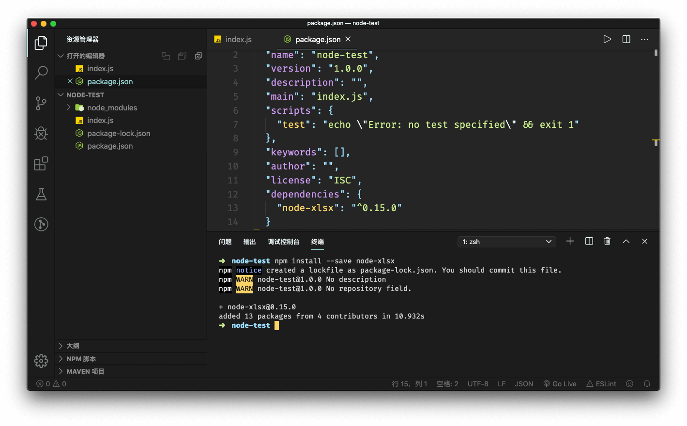

首先，我们拿到了问卷填写人员的名单。

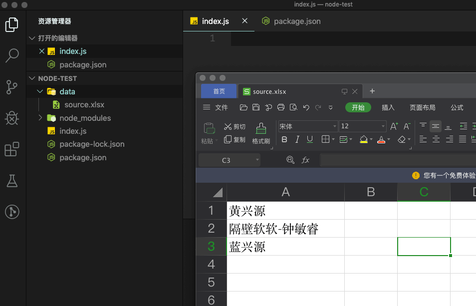

再根据 node-xlsx 的文档，写出代码。

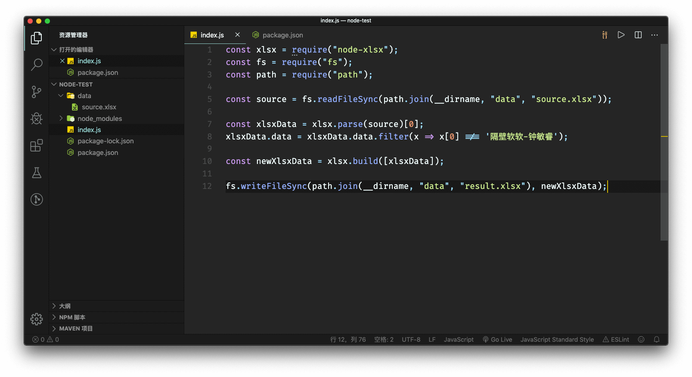。

运行`node index.js`，就得到了我们要的东西。

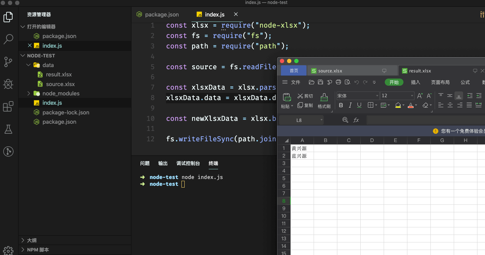。

到这里，我们就实现了需求，这只是冰山一角，node.js 能做的事情还很多。

## 如何运行别人的 node 项目

我们将代码上传至 GitHub 时，一般都会将依赖之类的文件添加进`.gitignore`。所以每次 clone 一个 node 项目我们都需要重新下载依赖。例如，上面的那个过滤问卷名单的例子 🌰，我已经将代码放到了 GitHub 上。

https://github.com/ChenKS12138/node-demo-tutorial

我们 clone 了这个仓库后，文件目录应该如下，没有`node_modules`。因此我们需要下载依赖。

> .
> ├── README.md
> ├── data
> │ └── source.xlsx
> ├── index.js
> ├── package-lock.json
> └── package.json

运行`npm install`就可以下载依赖了。

## 结语

node 能做的事情还很多，这个只是一小部分。至此，你已经打开的新世界的大门。

