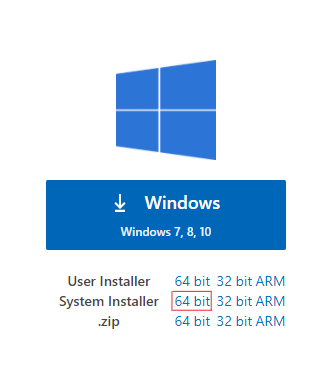
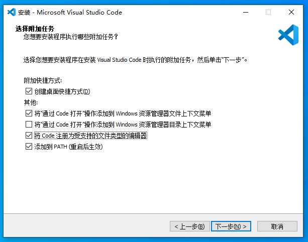
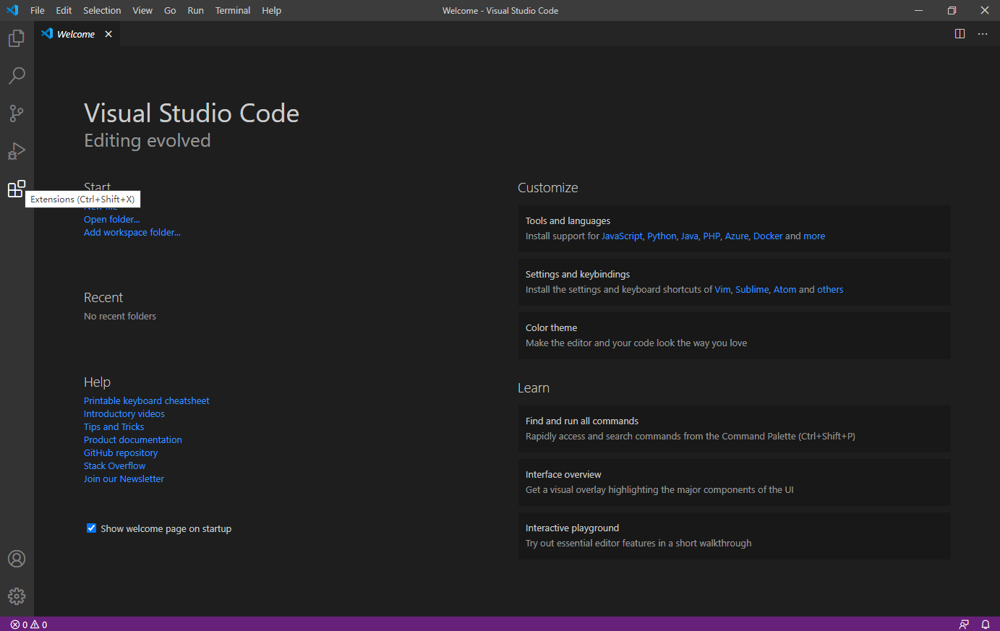
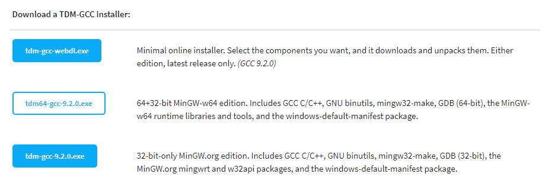
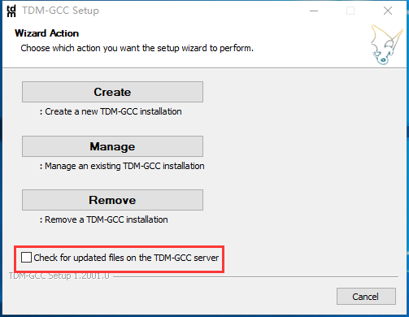
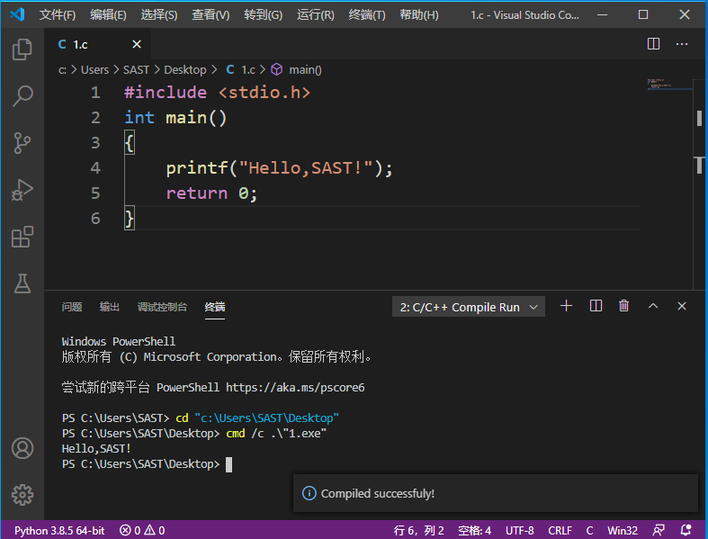
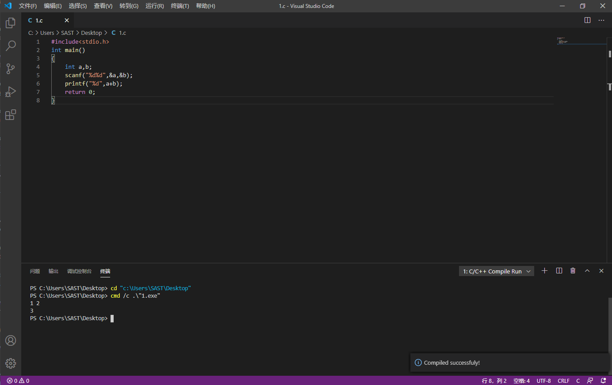
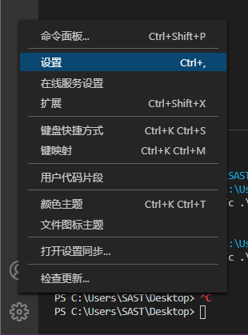
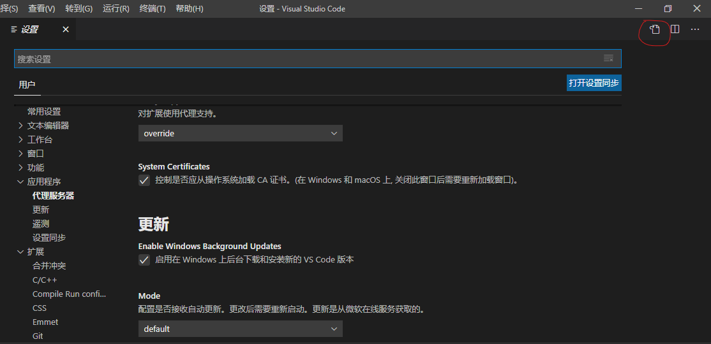

---

title: C/C++环境配置指南
date: 2020-09-25
authors: 
   - xjzsq
categories:
    - blog
tags: C C++ Dev-C++ vscode gcc 
---

本文将介绍常见的`C/C++`环境配置方法。  

<!--more-->

### Devcpp

- 适用平台：winxp/win7/win10
- 所需文件：`Dev C++ 5.11(TDM-GCC 4.9.2)`
- 配置步骤
  
  1. 在安装包上单击右键选择`以管理员身份运行`,语言默认选择`English`,然后点击`OK`.
  
  2. 点击 `I Agree` ,之后点击`Next`.
  
  3. 选择安装路径(建议选择纯英文路径),之后点击`Install`.
  
  4. 安装完成后点击`Finish`并打开`Dev-C++`.
  
  5. 打开后选择语言为`简体中文/Chinese`,并点击`Next`.
  
  6. 选择性配置皮肤等,完成配置.
  
  7. 选择 `文件->新建->源代码` 或使用快捷键 `Ctrl+N` 新建一个文件,输入以下C语言代码:
  
     ``` c
     #include <stdio.h>
     int main()
     {
     	printf("Hello,SAST");
     	return 0;
     } 
     ```
     
   8. 选择 `文件->保存` 或使用快捷键 `Ctrl+S` 进行保存,保存类型选择 `C source files(*.c)`,按需选择名字与保存位置,点击 `保存` 即可.
  
   9. 保存成功后选择 `运行->编译运行` 或使用快捷键 `F11` 将C语言文件编译并运行,输出`Hello,SAST`即可.

- 常见问题Q&A
  
  1. 为什么我按笔记本键盘上的`F11`没有反应?
     部分笔记本需要先按下键盘上的 `Fn` 键,然后再按 `F11` 才有效果;也有部分笔记本需要按住 `Fn` 键不放按 `F11` 才有效果.如果均无效,则可能是快捷键冲突,请使用 `运行->编译运行` 的方法编译运行程序.

### VSCode(Visual Studio Code)
- 写在前面
  **Visual Studio Code**（以下简称**VSCode**）是一个运行于**Mac OS X**、**Windows**和**Linux**之上的，针对于编写现代**Web**和云应用的**跨平台源代码编辑器**。
  
  该编辑器集成了所有一款现代编辑器所应该具备的特性，包括**语法高亮（syntax high lighting）**，**可定制的热键绑定（customizable keyboard bindings）**，**括号匹配（bracket matching）**以及**代码片段收集（snippets）**。同时这款编辑器也拥有对**Git**的开箱即用的支持。
  
  
  
- 适用平台： win7/win10/Mac OS  

- 所需文件：`VSCode`

- 安装步骤 - win10
  0. 演示环境：`Windows 10 专业版 64位（版本：2004）` 官网下载镜像虚拟机  
   同类优秀教程阅读：[Visual Studio Code 配置 C/C++ 环境 | 0xfaner's Blog](https://0xfaner.top/posts/vscode-config/#more)
  
  1. 下载 `VSCode` 安装包  `VSCodeSetup-x64-1.49.2.exe` ，可在校科协招新群文件内下载，也可去[官网下载](https://code.visualstudio.com/#alt-downloads)，请点击 `System Installer` 后的 `64 bit` （根据[系统位数]([如何查看Windows 系统位数-百度经验 (baidu.com)](https://jingyan.baidu.com/article/27fa73265ed13046f8271f19.html))选择）下载安装包 。  
     
     
  2. 以管理员身份运行安装包，选择安装位置时最好选择不含中文的路径，建议按照图片所示选择附加任务：  
       
     
  3. 点击左侧 `Extensions` 按钮或使用快捷键 `Ctrl+Shift+X` 打开扩展商店。  
     
     
  4. 搜索 `Chinese` 安装语言包 `Chinese (Simplified) Language Pack for Visual Studio Code` 以汉化 `VSCode` ；搜索 `C++` 安装插件 `C/C++` 和 `C/C++ Compile Run` ，以获得 `C/C++` 编辑器环境和按下 `F6` 快速运行体验。（安装完语言包后右下角可能会提示重启，点击重启即可）   
  
  5. 下载 `TDM-GCC` ，可在校科协招新群群文件内下载，也可去[官网下载](https://jmeubank.github.io/tdm-gcc/download/)，点击 `tdm64-gcc-9.2.0.exe` 下载。  
     
      
     
  6. 以管理员身份运行安装包，去掉 `Check for updated files on the TDM-GCC server` 前面的勾，点击 `Create` 按钮进入安装，选择安装位置时安装路径**不能有英文**，其他请一路 `Next` 即可。  
     
  
  7. 切回 `VSCode` 新建一个后缀名为 `c` 的文件，如 `Paste.c` 。（新建文件直接保存，文件类型**选择 `C` **）  
       
  
  并输入以下代码：  
  
     ``` c
     #include <stdio.h>
     int main()
     {
         printf("Hello,SAST!");
         return 0;
     }
     ```
   然后按下 `F6` 或 `Ctrl+6` 编译运行，如果能够得到下图结果，则表示环境配置成功！祝贺祝贺！(缩小窗口截图)  
  
       
     ``` c
      #include <stdio.h>
      int main()
      {
          int a, b;
          scanf("%d%d", &a, &b);
          printf("%d", a + b);
          return 0;
      }
     ```
     然后按下 `F6` 或 `Ctrl+6` 编译运行，并输入 `1 2` ，如果能够得到下图结果，则表示环境配置成功！祝贺祝贺！  
     
  
  8. 进一步配置...
     感觉字体太小了?还没法用 `Ctrl+鼠标滚轮` 放大缩小?代码空格太多了不想输入?  进行进一步配置非常重要！点击左下角的设置图标，选择 `设置` 或使用快捷键 `Ctrl+,` 打开设置界面。（也可以按`Ctrl+Shift+P`，键入`Open Settings (JSON)`，选择 `首选项：打开设置(json)` ，直接打开 `settings.json`文件）
       
     然后点右上角第一个按钮打开 `settings.json` 配置文件。  
     
  
  9. 如果想要使用鼠标滚轮缩放，在大括号内插入以下脚本：  
     ``` json
      "editor.mouseWheelZoom": true,
     ```
     如果使用代码格式化，请插入以下脚本：
     ```text
     "editor.formatOnPaste": true,
     "C_Cpp.clang_format_fallbackStyle": "{ BasedOnStyle: Microsoft, UseTab: Never, IndentWidth: 4, TabWidth: 4, AllowShortBlocksOnASingleLine: true, AllowShortIfStatementsOnASingleLine: true, AllowShortLoopsOnASingleLine: true, AllowShortCaseLabelsOnASingleLine: true, AllowShortFunctionsOnASingleLine: All, AllowShortLambdasOnASingleLine: All,  }",
     "[cpp]": {
     	"editor.defaultFormatter": "ms-vscode.cpptools"
     },
     "editor.formatOnSave": true,
     "C_Cpp.clang_format_style": "{ BasedOnStyle: Microsoft, UseTab: Never, IndentWidth: 4, TabWidth: 4, AllowShortBlocksOnASingleLine: true, AllowShortIfStatementsOnASingleLine: true, AllowShortLoopsOnASingleLine: true, AllowShortCaseLabelsOnASingleLine: true, AllowShortFunctionsOnASingleLine: All, AllowShortLambdasOnASingleLine: All,  }",
     ```
     如果有对 `C++` 版本的要求，请在大括号插入（以 `C++11` 为例）：
  
     ```json
     "C_Cpp.default.cppStandard": "c++11"
     ```
     **改变配置后推荐重启VSCode**，以便设置生效。
- 常见问题Q&A

  1. 可以配置按 `F5` 调试运行?  
     这个可以参考柏老板的配置教程：[Visual Studio Code 配置 C/C++ 环境教程 | 0xfaner's Blog](https://blog.0xfaner.site/posts/vscode-cpp-config/)
  2. 为什么我按下 `F6` 无法成功运行？  
     请检查TDM安装位置是否含有中文，中文符号也不行！另外，如果是笔记本的话，看一下是否 `F6` 默认是功能键，尝试使用 `Fn+F6` ( 按住 `Fn` 键不放按 `F6` ) 编译运行。另外也可以尝试使用 `Ctrl+6` 组合键来编译运行。  

