---

title: Python环境配置指南
date: 2020-09-25
authors: 
   - xjzsq
categories:
    - blog
tags: Python IDLE vscode pycharm 
---

本文将介绍常见的`Python` 环境配置方法。  

<!--more-->

### Python3本体安装

- 适用平台：win7/win10/Mac OS X
- 演示环境：`Windows 10 专业版 64位（版本：2004）` 
- 配置步骤：
  1. 在[Python3.8.5官方下载页](https://www.python.org/downloads/release/python-385/)拉到最下方点击 `Windows x86-64 executable installer` 或在校科协新生群群文件下载安装包，右击以管理员身份运行此安装包，先在 `Add Python 3.8 to PATH` 前面的框打勾，然后点击 `Customize installation` 。
     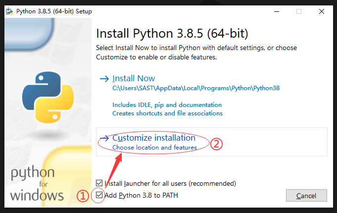
     
  2. 之后再点击 `Next` 进入 `Advanced Options` 设置页，在 `Install for all users` 前打勾，可以选择修改路径名（建议不要修改，如果必须修改请使用英文路径），然后点击 `Install`  
     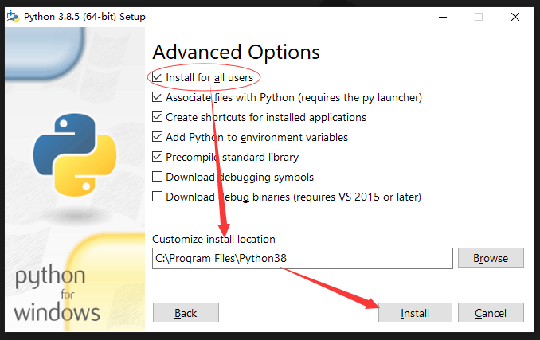
     
  3. 安装完成后，点击 `Disable path length limit` ，以保证python的配置能够成功写入path，然后关闭即可。
     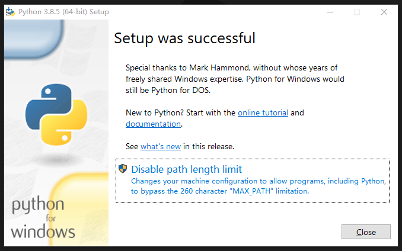
     
  4. 首先打开开始菜单Python文件夹下的 `Python 3.8(64-bit)`   
     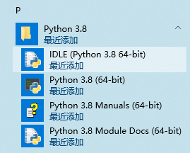   
     
     输入以下python脚本并回车：  
     
     ``` python
     print("Hello,SAST!")
     ```
     如果能够得到下图结果说明运行正常。  
     
     
  5. 在命令行写python脚本不便于调试，为了能够保存成.py脚本文件，打开开始菜单Python文件夹下的 `IDLE` ，点击菜单栏 `File->New File` 或使用快捷键 `Ctrl+N` 新建一个脚本文件，并写入以下脚本：  
     ```python
     x = 'SAST'
     if x == "SAST":
         print("Hello,SAST!")
     else:
         print("Hello,World!")
     ```
     保存后按 `F5` 或点击菜单栏 `Run->Run Module` 即可运行脚本。  
     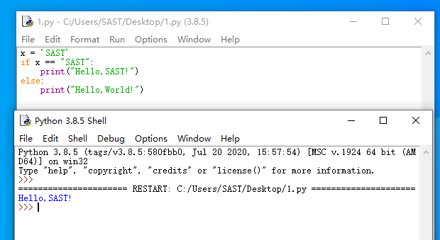    
  
  6. Python的强大得益于第三方库的支持，下面介绍如何安装第三方库：  
     按下快捷键 `Win+R` 然后输入 `cmd` （或 `powershell` ）打开命令提示符，然后输入`pip install xxx` 即可安装名为 `xxx` 的第三方库。例如校科协爬虫公开课将会用到 `requests` 库，则输入：
  
     ``` bash
     pip install requests
     ```
  
     得到如下结果即为安装成功：  
  
     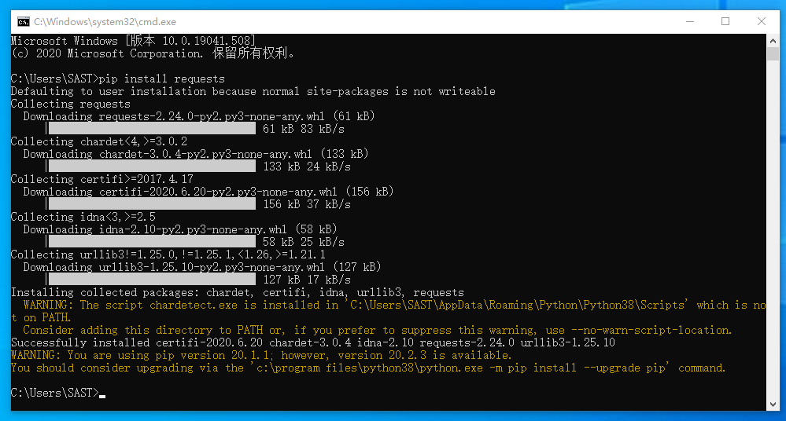
     （可能有些库的安装需要以管理员身份运行命令行才能成功安装，方法为在左下角开始菜单键上右击选择 `Windows Powershell（管理员）` ）     
- 常见问题Q&A
  
  1. 安装过程中提示没有文件夹读写权限?
     请以管理员身份运行安装包
  2. 校科协公开课需要安装哪些第三方库？
     需要安装 `re` 和 `requests` 库

### VSCode配置
- 适用平台：win7/win10/Mac OS X

- 演示环境：`Windows 10 家庭版 64位（版本：2004）` 

- 配置步骤
  
  0. 需要前置安装Python3本体
  
  1. 按照配置C语言环境VSCode的1~3步安装VSCode
  
  2. 在第1步最后打开的插件管理器中：搜索 `Chinese` 安装语言包 `Chinese (Simplified) Language Pack for Visual Studio Code` 以汉化 `VSCode` ；搜索 `Python` 安装第一个插件以使VSCode支持python。
  
  3. 安装好后打开之前的脚本或新建文件写入以下脚本：
  
     ``` python
     x = 'SAST'
     if x == "SAST":
         print("Hello,SAST!")
     else:
         print("Hello,World!")
     ```
  4. 按下 `F5` 选择第一项 `Python File` ，如果结果和下图一致则配置成功。
  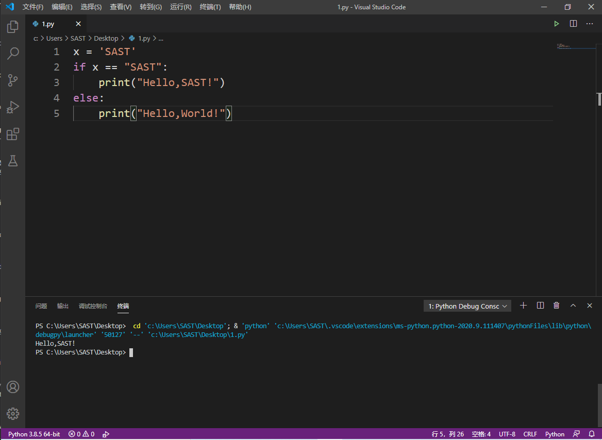  
- 常见问题Q&A  
  
  1. ...

### PyCharm
- 适用平台：win7/win10/Mac OS X 
- 演示环境：`Windows 10 专业版 64位（版本：2004）`  
- 配置步骤：
  0. 需要前置安装Python3本体  
  
  1. 在[官方下载页面](https://www.jetbrains.com/pycharm/download/#section=windows)点击 `Community` 版本下面的 `Download` 按钮或在校科协新生群中下载，以管理员身份运行安装包，两次 `Next` 后如图打勾，之后继续安装即可。
     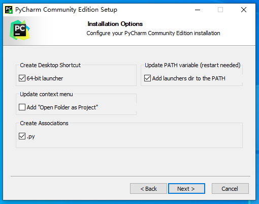
  
  2. 打开软件后按照自身需要选择即可，然后选择 `New Project` 。
     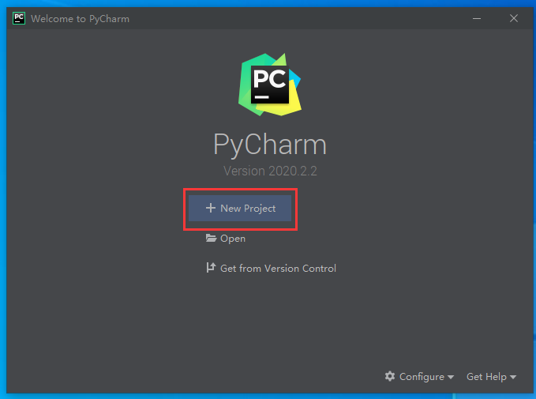  
  
  3. 重新输入项目位置和项目名称，重新选择 `Base interpreter` 为上面Python的安装位置。  
     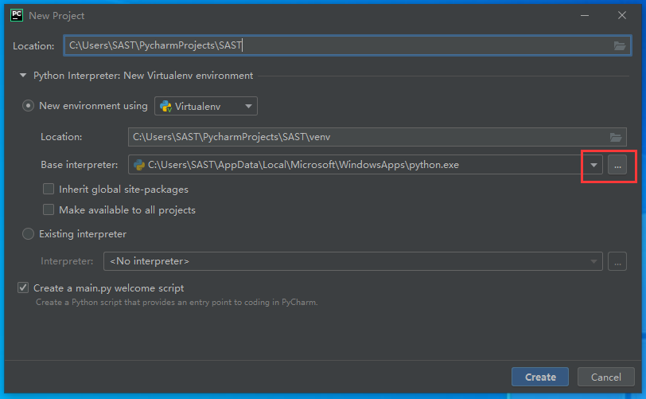
     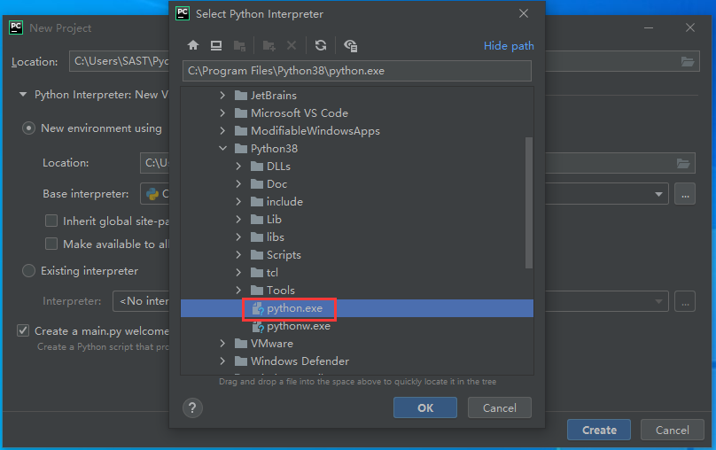  
  
  4. 环境配置需要下载库，可能需要等待一段时间。  
  
  5. 按 `shift+F10` 或点击菜单 `Run->Run 'main'` 运行，如果运行结果如下图所示，则环境配置成功。  
     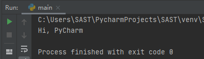