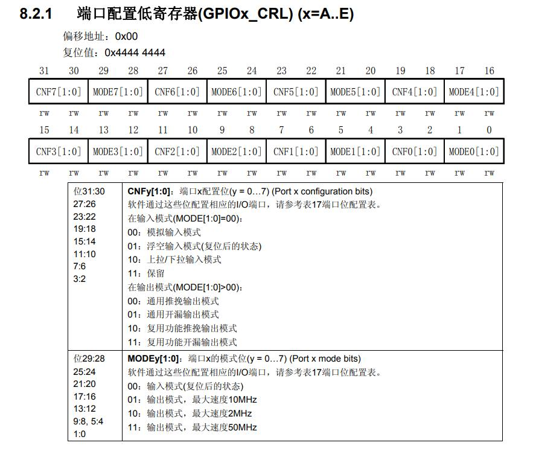
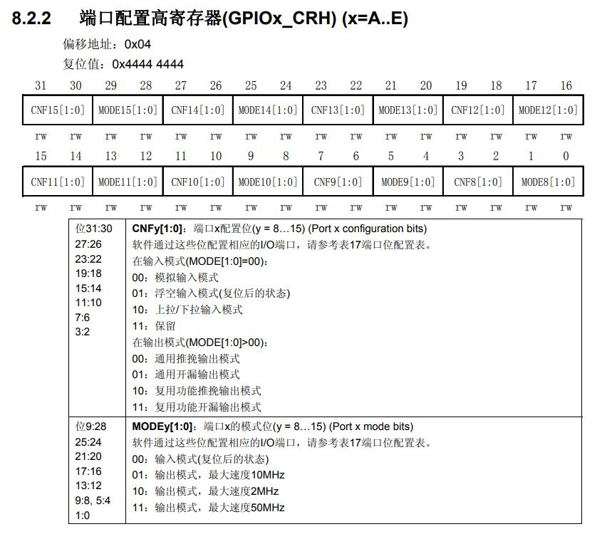
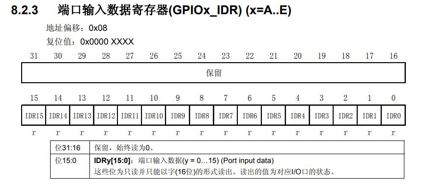
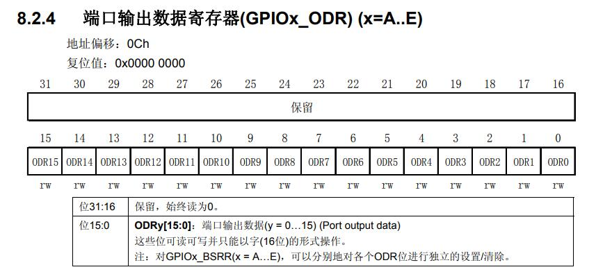
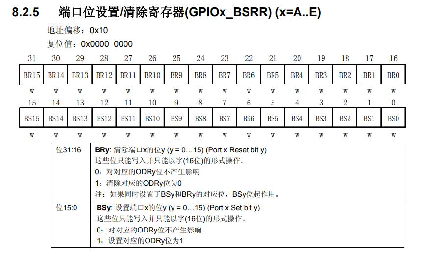
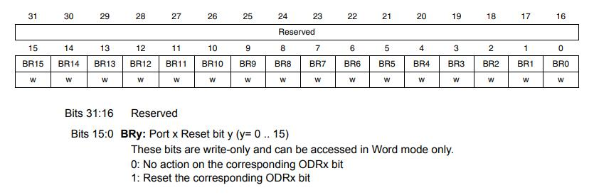

<!--more-->

## GPIO寄存器介绍

&emsp;&emsp;对单片机外设的操作就是对寄存器的操作，无论是所谓标准库还是所谓HAL库，都只是形式而已。那么，想要深入地了解STM32的GPIO，学会实现功能和排查问题，就必须对GPIO有一个比较好的认识。

&emsp;&emsp;对于STM32F1系列而言，每个GPIO端口具备七个寄存器，他们分别是——两个配置寄存器（CRL、CRH）、两个数据寄存器（IDR、ODR）、一个置位、复位寄存器（BSRR）、一个复位寄存器（BRR）、一个锁定寄存器（LCKR）。以下是简略的介绍：

### CRL与CRH（configuration register low/high）

&emsp;&emsp;CRL与CRH都是端口配置寄存器，他们都是32位的，这两个寄存器的性质一样，用于存储表示GPIO模式的信息。我们知道，STM32每组GPIO有16个IO，那么，两个配置寄存器提供的数据量为64bit，每个IO分到的就是4bit，这4bit的数据就描述了一个IO的配置。

&emsp;&emsp;从手册中我们可以看到每个IO对应的“4bit”是如何分配的：（来自STM32中文参考手册V10，RM0008的翻译版本，后同）





&emsp;&emsp;需要注意的是，CRL和CRH只能以“字”（对于32位体系，字为32位，半字为16位，字：Word，半字：Half Word）的形式读出和写入，例子如下：

```c
GPIOA->CRL  = 0xFFFFFFFF;//对GPIOA的CRL写入数据
```

### IDR与ODR（input/output data register）

&emsp;&emsp;IDR是GPIO的输入数据寄存器。其实它是个32位的寄存器，但是，由于一个GPIO端口只有16个IO，所以，该寄存器的高16bit保留，如果尝试读出的话，这些位始终为0。低16bit与IO的对应关系见下图：



&emsp;&emsp;（你应该能注意到那个“r”和前面的“rw”的区别吧？）


&emsp;&emsp;ODR是GPIO的输出数据寄存器。它同样是32位寄存器，但是高16bit保留。



&emsp;&emsp;另外，值得注意的是，IDR和ODR寄存器的低16bit可以以16bit的形式操作（其实应该说半字），例如这样：

```c
GPIOA->ODR = 0XFFFF;
uint16_t value = (uint16_t)GPIOA->IDR;
```

### BSRR（ bit set/reset register）

&emsp;&emsp;设置GPIO某一位（即某一单独的IO）的状态是单片机编程中常见的操作，但是，如果直接向ODR寄存器写数据的话，16个IO的状态都受输入数据的影响。当然也不是没有单独操作某一位的方法——先读出ODR现有的数据，修改某一bit以后再写回去。不过呢，这样在实现上麻烦一些，而且速率不如操作BSRR寄存器。

&emsp;&emsp;前面提到过BSRR是一个“置位/复位寄存器”（Set/Reset），意思就是操作这个寄存器可以把IO电平拉高或者拉低，具体怎么做呢？手册说得很清楚：



&emsp;&emsp;我们可以直接对BSRR写入16bit的数据，这样的话起到的作用将是Set（拉高IO电平）。

&emsp;&emsp;BSRR同时也支持32位写入，如下：

```c
GPIOA->BSRR = (~data & 0xff)<<16 | (data & 0xff);//请分析这段代码实现的功能
```

&emsp;&emsp;不过，光是这么说的话，你可能不会太注意到寄存器名称里“bit”的用意。这样，让我们来分析一下BSRR是怎么操作IO的：

* 首先，单片机复位后，BSRR所有位为0。
* 往BSRR写入数据，例如0X0001——将某个GPIO端口的Pin_0置高。
* GPIO将对应的Pin设置为指定的状态，完成后将BSRR清零。

&emsp;&emsp;值得一提的是，直接决定IO输出状态的是ODR寄存器的内容，F1的手册里对于相关内容没有明确的说明，但F4的手册中指出BSRR对ODR具有位操作权限（姑且认为它们GPIO的实现差不太多吧）

&emsp;&emsp;总之，我们可以往BSRR里写数据来实现"一次操作即可改变指定IO的状态"，而一些宏则让这个过程更加直观了，如下：（摘自stm32f10x_gpio.h V3.5.0）

```c
/** @defgroup GPIO_pins_define 
  * @{
  */

#define GPIO_Pin_0                 ((uint16_t)0x0001)  /*!< Pin 0 selected */
#define GPIO_Pin_1                 ((uint16_t)0x0002)  /*!< Pin 1 selected */
#define GPIO_Pin_2                 ((uint16_t)0x0004)  /*!< Pin 2 selected */
#define GPIO_Pin_3                 ((uint16_t)0x0008)  /*!< Pin 3 selected */
#define GPIO_Pin_4                 ((uint16_t)0x0010)  /*!< Pin 4 selected */
#define GPIO_Pin_5                 ((uint16_t)0x0020)  /*!< Pin 5 selected */
#define GPIO_Pin_6                 ((uint16_t)0x0040)  /*!< Pin 6 selected */
#define GPIO_Pin_7                 ((uint16_t)0x0080)  /*!< Pin 7 selected */
#define GPIO_Pin_8                 ((uint16_t)0x0100)  /*!< Pin 8 selected */
#define GPIO_Pin_9                 ((uint16_t)0x0200)  /*!< Pin 9 selected */
#define GPIO_Pin_10                ((uint16_t)0x0400)  /*!< Pin 10 selected */
#define GPIO_Pin_11                ((uint16_t)0x0800)  /*!< Pin 11 selected */
#define GPIO_Pin_12                ((uint16_t)0x1000)  /*!< Pin 12 selected */
#define GPIO_Pin_13                ((uint16_t)0x2000)  /*!< Pin 13 selected */
#define GPIO_Pin_14                ((uint16_t)0x4000)  /*!< Pin 14 selected */
#define GPIO_Pin_15                ((uint16_t)0x8000)  /*!< Pin 15 selected */
#define GPIO_Pin_All               ((uint16_t)0xFFFF)  /*!< All pins selected */
```

### BRR（ bit reset register）

&emsp;&emsp;BRR寄存器是一个很尴尬的寄存器。它是一个32位寄存器，高16bit保留，低16bit实现复位GPIO各个Pin的功能，如下：



&emsp;&emsp;它尴尬就尴尬在——它的功能可以被BSRR的高16bit完全替代（所以在F4里它没了）

&emsp;&emsp;然后，你可以以16bit来操作这个寄存器，如下：

```c
GPIOA->BRR = 0XFFFF;
```

### LCKR（configuration lock register）

&emsp;&emsp;用得不多，自己了解。


## 标准库下的GPIO操作

&emsp;&emsp;熟悉了寄存器以后，再来使用库函数就会感觉很轻松了，标准库尤其如此——标准库试图把各种操作都“一板一眼”地实现，结果各种函数一多，难免显得有些繁琐，函数说明读起来确实会觉得有些头疼。不过，如果能自己读一下函数的实现，再结合已有的寄存器知识，其实很容易理解。

&emsp;&emsp;比如，我们来看看常用的GPIO_SetBits()，其实现如下：（摘自stm32f10x_gpio.c V3.5.0）

```c
void GPIO_SetBits(GPIO_TypeDef* GPIOx, uint16_t GPIO_Pin)
{
  /* Check the parameters */
  assert_param(IS_GPIO_ALL_PERIPH(GPIOx));
  assert_param(IS_GPIO_PIN(GPIO_Pin));
  
  GPIOx->BSRR = GPIO_Pin;
}
```

&emsp;&emsp;前两句是所谓“断言”，意在检查参数是否符合一定的规则。而实现功能的语句，就是`GPIOx->BSRR = GPIO_Pin;`这一句而已。

&emsp;&emsp;嗯，看到这估计你已经能猜到GPIO_ResetBits是咋实现的了，没错，就是那样！

```c
void GPIO_ResetBits(GPIO_TypeDef* GPIOx, uint16_t GPIO_Pin)
{
  /* Check the parameters */
  assert_param(IS_GPIO_ALL_PERIPH(GPIOx));
  assert_param(IS_GPIO_PIN(GPIO_Pin));
  
  GPIOx->BRR = GPIO_Pin;
}
```


&emsp;&emsp;现在，我们来列一列gpio.c里常用的函数吧，如下：

```c
void GPIO_DeInit(GPIO_TypeDef* GPIOx);
void GPIO_Init(GPIO_TypeDef* GPIOx, GPIO_InitTypeDef* GPIO_InitStruct);
uint8_t GPIO_ReadInputDataBit(GPIO_TypeDef* GPIOx, uint16_t GPIO_Pin);
uint16_t GPIO_ReadInputData(GPIO_TypeDef* GPIOx);
uint8_t GPIO_ReadOutputDataBit(GPIO_TypeDef* GPIOx, uint16_t GPIO_Pin);
uint16_t GPIO_ReadOutputData(GPIO_TypeDef* GPIOx);
void GPIO_SetBits(GPIO_TypeDef* GPIOx, uint16_t GPIO_Pin);
void GPIO_ResetBits(GPIO_TypeDef* GPIOx, uint16_t GPIO_Pin);
void GPIO_WriteBit(GPIO_TypeDef* GPIOx, uint16_t GPIO_Pin, BitAction BitVal);
void GPIO_Write(GPIO_TypeDef* GPIOx, uint16_t PortVal);
```

&emsp;&emsp;GPIO_Init和DeInit比较麻烦，而且一般用不着太了解，就不讲了。SetBits和ResetBits是操作BSRR和BRR。然后呢，Write是操作ODR，WriteBit则是视情况操作BSRR或BRR；ReadInputData是读IDR寄存器内容，ReadInputDataBit是读IDR以后判断指定位的状态；ReadOutputData是读ODR寄存器内容，ReadOutputDataBit是读ODR以后判断指定位的状态。

&emsp;&emsp;总的来说，虽然函数一大堆，但是对于GPIO的操作主要就是变着法地读、写IDR、ODR、BSRR、BRR这四个寄存器，然后对得到地信息进行一些处理之后返回一些值，只要了解了寄存器地特性，就不会对这些函数感到头疼了。

&emsp;&emsp;当然，还有个办法缓解众多函数名带来的头疼症状——减少函数的数量。


## HAL库下的GPIO操作

&emsp;&emsp;HAL的设计追求简洁和通用，虽然这样会导致层级复杂、单个函数承担的功能更多，并且需要更多各种各样的宏等等问题，但是使用起来确实很简单，比如，以GPIO的操作为例，stm32f1xx_hal_gpio.c里和IO操作直接关联的函数就三个：

```c
GPIO_PinState HAL_GPIO_ReadPin(GPIO_TypeDef *GPIOx, uint16_t GPIO_Pin);
void HAL_GPIO_WritePin(GPIO_TypeDef *GPIOx, uint16_t GPIO_Pin, GPIO_PinState PinState);
void HAL_GPIO_TogglePin(GPIO_TypeDef *GPIOx, uint16_t GPIO_Pin);
```

&emsp;&emsp;挨个分析一下吧，先看看GPIO_PinState是个什么东东。

```c
typedef enum
{
  GPIO_PIN_RESET = 0u,
  GPIO_PIN_SET
} GPIO_PinState;
```

&emsp;&emsp;嗯，是个枚举类型，第一个成员是0，枚举类型里成员的值是递增的，步进值为1。所以，GPIO_PIN_RESET就是0，GPIO_PIN_SET就是1，GPIO_PinState这个类型的数据只能取这两个值。

&emsp;&emsp;然后，以下是HAL_GPIO_ReadPin()的实现：

```c
GPIO_PinState HAL_GPIO_ReadPin(GPIO_TypeDef *GPIOx, uint16_t GPIO_Pin)
{
  GPIO_PinState bitstatus;

  /* Check the parameters */
  assert_param(IS_GPIO_PIN(GPIO_Pin));

  if ((GPIOx->IDR & GPIO_Pin) != (uint32_t)GPIO_PIN_RESET)
  {
    bitstatus = GPIO_PIN_SET;
  }
  else
  {
    bitstatus = GPIO_PIN_RESET;
  }
  return bitstatus;
}
```

&emsp;&emsp;可以看到，这个函数做的工作是判断指定的位的状态，全为0则返回0，否则返回1。


&emsp;&emsp;接下来看看HAL_GPIO_WritePin()的实现：

```c
void HAL_GPIO_WritePin(GPIO_TypeDef *GPIOx, uint16_t GPIO_Pin, GPIO_PinState PinState)
{
  /* Check the parameters */
  assert_param(IS_GPIO_PIN(GPIO_Pin));
  assert_param(IS_GPIO_PIN_ACTION(PinState));

  if (PinState != GPIO_PIN_RESET)
  {
    GPIOx->BSRR = GPIO_Pin;
  }
  else
  {
    GPIOx->BSRR = (uint32_t)GPIO_Pin << 16u;
  }
}
```

&emsp;&emsp;可以看到，BRR惨遭抛弃，这个函数用BSRR实现了Set/Reset指定位的功能。


&emsp;&emsp;然后，来看看HAL_GPIO_TogglePin()的实现：

```c
void HAL_GPIO_TogglePin(GPIO_TypeDef *GPIOx, uint16_t GPIO_Pin)
{
  /* Check the parameters */
  assert_param(IS_GPIO_PIN(GPIO_Pin));

  if ((GPIOx->ODR & GPIO_Pin) != 0x00u)
  {
    GPIOx->BRR = (uint32_t)GPIO_Pin;
  }
  else
  {
    GPIOx->BSRR = (uint32_t)GPIO_Pin;
  }
}
```

&emsp;&emsp;这个函数提供了翻转指定IO的电平状态的功能，用起来挺方便的，你可以把这个函数添加到自己的工程模板里面。


&emsp;&emsp;总结一下，HAL提供的函数是非常简洁的，而且是一种通用化的设计。但是，有个比较严重的问题——很多时候，你不能直接通过HAL库提供的函数实现操作寄存器能实现的所有功能，例如，读取GPIOA端口全部IO的状态并返回一个uint16_t 类型的数据，操作寄存器是`uint16_t value = GPIOA->IDR`，但是用HAL的话就无法直接实现（当然你也可以一位一位地读数据然后拼起来）。这也就导致，虽然HAL库看起来比标准库简单得多，而且像CubeMX这些提供了很多方便的诸如时钟配置、外设配置之类的功能。但是，要想灵活使用，需要使用者对于外设的特性、寄存器等等有着更加深入的了解——这也就是为什么我不推荐新手采用HAL库上手STM32。

&emsp;&emsp;顺便再说几句吧，作为电子技术的学习者，不应该太过依赖于平台。平台总是会过时的，但是公式和定理不会——最多被修正一下。51会过时，stm32会过时。但是，UART、IIC、SPI协议不会过时；编译原理、计算机体系结构不会过时；各种实现和设计的思路不会过时······多用几种单片机，会发现IDR、ODR到处都有；用用C#和Qt，发现怎么Button、comboBox之类的控件大家都差不多；多用几个换板子的软件，发现拉线、铺铜、过孔啥的，全世界好像都一样······


&emsp;&emsp;在经历中总结，找到那些到处都有的东西，这是学习者必做的功课——特别是对于单片机技术的学习者。如果之前没有对寄存器有过比较详细的了解的话，编写一篇这样的指南应该能给自己带来不少的收获，所以呢，我推荐大家自己找一款自己正在使用的开发平台，针对某一个功能写一篇类似的文档，简单练习一下。

&emsp;&emsp;不要求提交（咳，之前的还没回复完）。


