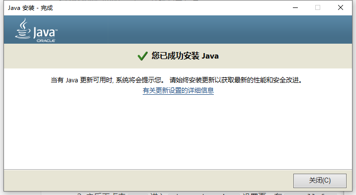
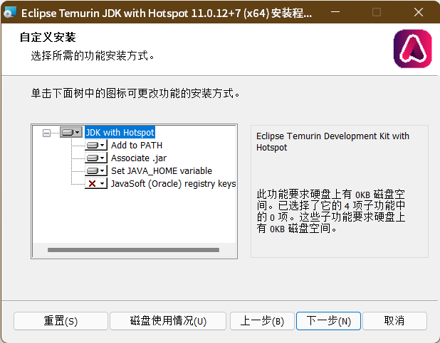
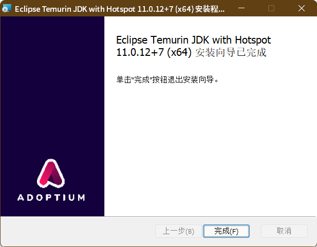
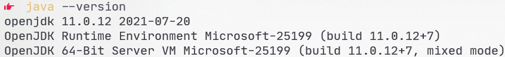

---
 
 title: Java 环境安装教程（自动配置环境变量）
 date: 2021-09-30
 authors: 
  - linyuqi9
  - Jisu-Woniu
 categories:
     - blog
 tags: Java Tutorial
---

注意，本文包含 Java 开发与运行环境配置，请选择自己需要安装的环境。

<!--more-->

## Java 下载安装

目前主流的 Java 版本分为 4 种，如下表所示：

| 版本 | Oracle Java | OpenJDK/OpenJRE | 区别 |
|:--:|:--:|:--:|:--:|
| 开发环境 | Oracle JDK | OpenJDK | 带有编译器 |
| 运行环境 | Oracle JRE | OpenJRE | 无编译器 |
| 区别 | 闭源，可付费商用 | 依据 GPL 协议开源 |  |

### Oracle JRE 8 下载安装

- 适用平台：Windows、macOS（Intel 芯片版 Mac）
- 演示环境：Windows 10 家庭中文版20H2
- 提示：Oracle JRE 只支持 Java 8 版本。如果程序要求 Java 11 或更高版本，请考虑安装 OpenJRE。

    如果需要配置 Oracle Java 开发环境（Oracle JDK），请参考：<https://www.oracle.com/java/technologies/downloads/>

- 配置步骤：
  1. 请务必使用 `chrome浏览器` 进入 Oracle Java 下载页面 <https://www.java.com/zh-CN/> 点击“免费 Java 下载”，再点击跳转后页面的“同意并开始免费下载”按钮，等待安装包下载完成。
  2. 右键以管理员身份运行安装包，在安装向导界面中点击“安装”并等待程序自动安装。
  3. 安装完成，如图所示。

### OpenJDK/OpenJRE 下载安装

- OpenJDK 是 Oracle 根据 GPL 协议开源的 JDK 源码，其中去除了一部分 Oracle 专有代码，因此可能与部分软件存在兼容问题。
- 适用平台：Windows、macOS
- 演示环境：Windows 11
- 提示：Oracle 在网站上提供了 [OpenJDK 的源码包](https://jdk.java.net/)，但是不提供安装包，所以需要~~自己动手编译~~下载安装第三方预编译版本。
    Eclipse Adoptium（原 AdoptOpenJDK）是一个比较流行的 OpenJDK 预编译版本，且支持自动配置环境变量。本教程以该版本 OpenJDK 为例。
- 配置步骤：
  1. 使用浏览器进入 Eclipse Adoptium OpenJDK 下载页面（<https://adoptium.net/archive.html>）选择需要下载的版本（如不确定需要下载哪个版本，推荐下载 OpenJDK 11）。
  2. 根据自己的系统配置选择对应版本的安装包，若要安装运行环境，请选择 JRE，若要下载开发环境，请选择 JDK。
     > 若官网下载速度慢，可以使用[清华大学提供的镜像](https://mirrors.tuna.tsinghua.edu.cn/AdoptOpenJDK/)
  3. 运行安装包，在安装向导界面中点击“安装”并等待程序自动安装。
  4. 使用默认设置完成安装，Windows 系统请确保 Add to PATH 和 Set JAVA_HOME variable 已勾选。
  
     

     

  5. 请打开系统终端，执行 `java --version` 查看是否安装成功。

     
- OpenJDK 官网：<https://openjdk.java.net/>
- 其他 OpenJDK 预编译包：
  - Microsoft 编译版本：<https://www.microsoft.com/openjdk>
  - RedHat 编译版本：<https://developers.redhat.com/products/openjdk/download>
  - IBM 编译版本：<https://developer.ibm.com/languages/java/semeru-runtimes/downloads>
