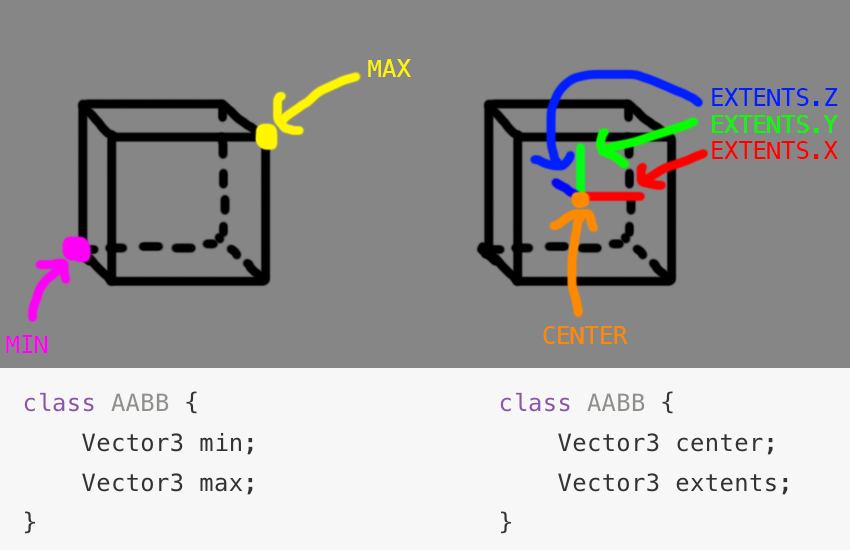

写这篇博文的起因是我在学习 runtime 的 mesh 切割算法时需要判断目标 mesh 是否和切面相交（不相交的话我就不需要去处理了）

<!--more-->

## 前提知识

Unity 的 mesh 和 collider 都使用 AABB 包围盒

### 什么是 AABB 包围盒？

AABB ==> Axis Aligned Bounding Box (轴对齐边界框)

AABB（轴对齐边界框）是一个 3D 框。它的宽度/高度/深度不必相等，但宽度始终与 X 轴对齐，高度与 Y 轴对齐，深度与 Z 轴对齐。也就是说，这个盒子是不能旋转的。

### 如何表示 AABB？

有两种常见的方法，存储最左边和最右边的角，或者存储中心点和盒子在每侧延伸多远的向量。

第一种：

```csharp
public struct AABB
{
    public Vector3 min;
    public Vector3 max;
}
```

第二种：

```csharp
public struct AABB
{
    public Vector3 center;
    public Vector3 extents;
}
```



## 算法

为了测试 AABB 和平面是否相交，我们首先必须将 AABB 的每个顶点投影到平面的法线上。这使我们 AABB 的所有顶点都在一条线上。

然后，我们检查离平面最远的顶点。如果与顶点对角线相对的顶点位于平面的另一侧，则我们有一个交点。

通用的 C# 代码如下，无论你的 AABB 是如何表示的(max/min 或 center/extents)，只需要稍作修改：

```csharp
// Test if AABB b intersects plane p
int TestAABBPlane(AABB b, Plane p) {
    // Convert AABB to center-extents representation
    Point c = (b.max + b.min) * 0.5f; // Compute AABB center
    Point e = b.max - c; // Compute positive extents

    // Compute the projection interval radius of b onto L(t) = b.c + t * p.n
    float r = e[0]*Abs(p.n[0]) + e[1]*Abs(p.n[1]) + e[2]*Abs(p.n[2]);

    // Compute distance of box center from plane
    float s = Dot(p.n, c) - p.d;

    // Intersection occurs when distance s falls within [-r,+r] interval
    return Abs(s) <= r;
}
```

### 让我们来解析这段代码

1. 函数传入了目标 Mesh 的 AABB，和目标平面
2. 进入后的两行假设你的 AABB 是用 max/min 表示的，如果你可以轻松调取 AABB 的 center 和 extents，那么这两行是可以被跳过的
3. 下一段代码计算了 AABB 的投影半径，这个半径是 AABB 投影到平面法线上的最大距离。
4. 其取 AABB 的范围和平面法线的绝对值的点积，用于确保计算出的长度是正值，因为两个向量中的元素都是正值或零。
   $$
   n' = (\lvert n_{x} \rvert,\lvert n_{y} \rvert,\lvert n_{z} \rvert) \\ \vec{e} \cdot \vec{n'} = \lvert\vec{e} \rvert \lvert\vec{n'} \rvert \cos \theta \\ \lvert\vec{n'} \rvert =1 \\\vec{e} \cdot \vec{n'} = \lvert\vec{e} \rvert  \cos \theta
   $$
5. 下面计算了 AABB 中心点到平面的距离，计为 s
6. 最后的返回值即为 AABB 自身在平面法线上的距离和其中心到平面距离长短的判断

### Unity 实现

```Csharp
public static bool BoundPlaneIntersect(Mesh mesh, ref Plane plane)
    {
        // Compute projection interval radius
        float r = mesh.bounds.extents.x * Mathf.Abs(plane.normal.x) +
            mesh.bounds.extents.y * Mathf.Abs(plane.normal.y) +
            mesh.bounds.extents.z * Mathf.Abs(plane.normal.z);//做点乘，得出mesh包围盒的范围在平面法线上的投影，包围盒在平面法线方向上的最大距离

        // Compute distance of box center from plane
        float s = Vector3.Dot(plane.normal, mesh.bounds.center) - (-plane.distance);//前面点乘得mesh中心在平面法线上的投影，这是为了确保计算出的距离和后面的平面距离在同一方向
        //如果法线面朝内，后- (-plane.distance)为正，前mesh中心在与相对原点相交且与平面平行的平面‘靠近平面的一侧，Vector3.Dot(plane.normal, mesh.bounds.center)为负，符合逻辑
        //因为mesh中心和平面在同一侧，距离为相见
        //若mesh中心在与 相对原点相交且与平面平行的平面‘ 远离平面的一侧，就是说mesh中心与平面中间相隔了一个原点，那么前后就都是同号，符合逻辑

        // Intersection occurs when distance s falls within [-r,+r] interval
        return Mathf.Abs(s) <= r;
    }
```

## 参考资料

1. [AABB - Axis Aligned Bounding Box](https://gdbooks.gitbooks.io/3dcollisions/content/Chapter1/aabb.html)
2. [Bounds-Unity_Documentation](https://docs.unity.cn/cn/2021.3/ScriptReference/Bounds.html)
